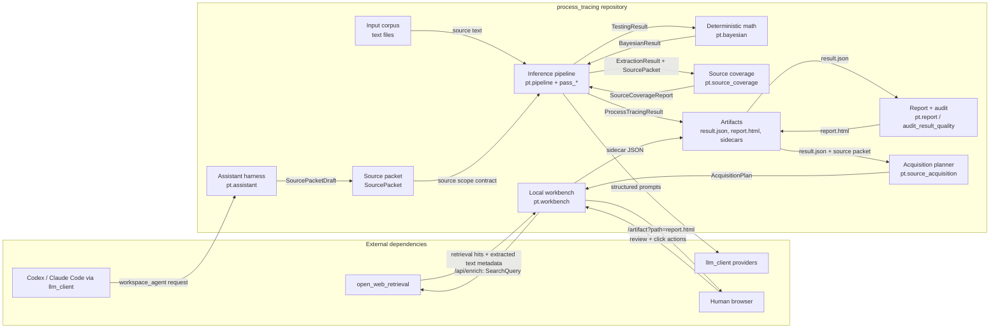
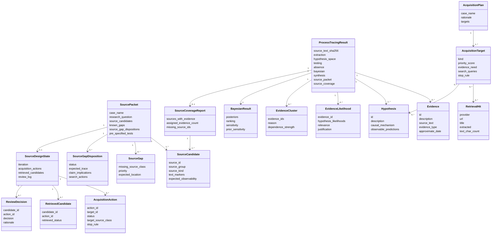
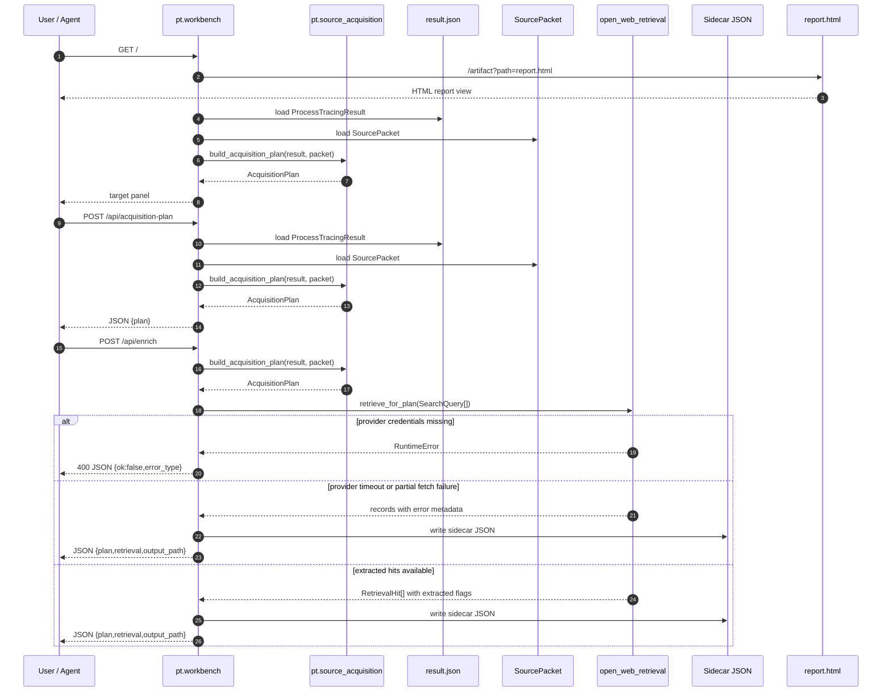

# Process Tracing Architecture

This document is the active design-plan architecture artifact for the current
SOTA+ process-tracing system. It records the deductive surfaces that can be
specified now and the exploratory surfaces that must remain instrumented until
validated across cases.

For the intended end-state architecture, including the full source-design
engine, trace-production model, benchmark runner, and within-case -> cross-case
bridge, see
[SOTA_PLUS_TARGET_ARCHITECTURE.md](/home/brian/projects/process_tracing/docs/SOTA_PLUS_TARGET_ARCHITECTURE.md).

## Frame

Goal: automate expert process tracing at PhD / think-tank / academic quality by
turning within-case causal inference into structured, auditable operations:
source-packet design, extraction, rival hypothesis generation, diagnostic
testing, deterministic support updating, report audit, and iterative source
acquisition.

Constraints:

- Single-case output is comparative support over the listed hypotheses, not an
  identified effect or probability of truth.
- LLMs perform semantic interpretation through structured `llm_client` calls.
- Deterministic code owns validation, math, source coverage, report generation,
  audit caps, and local workbench actions.
- Missing high-value source classes cap claim scope until acquired, explicitly
  accepted as limits, or dispositioned as unavailable.
- The local workbench is an action surface over artifacts; `result.json`,
  source packets, and sidecar JSON remain the source of truth.

Borrow-vs-build summary:

| Capability | Decision | Rationale |
|---|---|---|
| LLM structured calls | Borrow `llm_client` | Shared budget, trace, and schema governance. |
| Web retrieval | Borrow `open_web_retrieval` | Search/fetch/extract failures surface through typed results. |
| Bayesian update | Build locally | Process-tracing likelihood-vector math is core domain logic. |
| HTML report | Build locally | The report must expose this method's caveats, source caps, and diagnostics. |
| Workbench server | Build locally, small | It wraps local artifacts and exposes agent-drivable JSON endpoints. |

## Modality Split

| Surface | Mode | Contract |
|---|---|---|
| Pipeline stage schemas | Deductive | Pydantic models in `pt/schemas.py`. |
| Source packet and source coverage | Deductive | Pydantic models in `pt/source_packet.py` and deterministic marker coverage. |
| Bayesian update and sensitivity | Deductive | Pure functions in `pt/bayesian.py`; no LLM. |
| Workbench API | Deductive | `/api/acquisition-plan`, `/api/enrich`, and `/artifact` over typed artifacts. |
| Source adequacy | Exploratory | Source gaps, dispositions, and acquisition targets are instruments until sources are acquired and rerun. |
| Hypothesis partition quality | Hybrid | Structural failures can be detected; thresholds require benchmark readouts. |
| Methodological validation | Exploratory | Requires frozen cases, ablations, and independent review before strong claims. |

## Boundary Diagram



Boundary notes:

- `llm_client` and `open_web_retrieval` are dependencies, not local
  implementations.
- The workbench does not mutate the source packet or corpus yet. It writes
  sidecar acquisition and source-design JSON that a later approval step must
  promote.
- `report.html` is a view. `result.json` and typed source packets are the
  durable contracts.

## Domain Model Diagram



Domain-model notes:

- `EvidenceLikelihood` is a vector across hypotheses for one evidence item.
  Pairwise support ratios are derived from that vector.
- `SourceGapDisposition` can partially mitigate a gap without resolving it.
  Partial mitigation still leaves the high-priority gap unresolved for
  claim-scope grading.
- `SourceDesignState` is the mutable iteration artifact. Acquisition candidates
  remain candidates until reviewed, and review decisions update gap
  dispositions without auto-promoting a retrieval hit into evidence.
- `RetrievalHit` is not evidence until reviewed, added to the source packet or
  corpus, and rerun through extraction/testing.

## Data-Flow And Contract Diagram



Typed contracts:

| Boundary | Input | Output | Failure behavior |
|---|---|---|---|
| `python -m pt` | source text, optional `SourcePacket`, theories, priors | `ProcessTracingResult`, `report.html` | fail loud on short text, invalid source packet, malformed LLM output, invalid likelihood matrix |
| LLM pass boundary | prompt + Pydantic schema | Pydantic model from `pt/schemas.py` | fail loud through `llm_client`; no silent fallbacks |
| Bayesian update | `TestingResult`, hypothesis IDs, priors | `BayesianResult` | validation rejects missing vectors, unknown evidence, invalid clusters |
| Source coverage | `SourcePacket`, input text, `ExtractionResult` | `SourceCoverageReport` | unconfigured/missing/input-only sources become explicit coverage states |
| Audit | `ProcessTracingResult`, `report.html` | scorecard dict/text | claim-scope caps remain when unresolved source gaps exist |
| Workbench plan | `result_path`, `source_packet_path`, `max_targets` | JSON `{ok, plan}` | 400 JSON error when artifacts cannot load or validate |
| Workbench enrich | acquisition request + provider credentials | JSON `{ok, plan, retrieval, output_path}` | partial retrieval is recorded per hit; missing providers fail as JSON error |

## Backward Runtime Pass

Final runtime payload for the workbench:

```json
{
  "ok": true,
  "plan": "AcquisitionPlan",
  "retrieval": "optional list of target query hit groups",
  "output_path": "optional sidecar path"
}
```

Selector:

- `build_acquisition_plan()` ranks acquisition targets using current trace
  uncertainty: unresolved source gaps, damaging absences, sensitivity, and
  top-driver corroboration needs.

Evidence the selector reads:

- `SourcePacket.known_gaps`
- `SourcePacket.source_gap_dispositions`
- `AbsenceResult.evaluations`
- `BayesianResult.ranking`
- `BayesianResult.sensitivity`
- `BayesianResult.prior_sensitivity`
- `HypothesisPosterior.top_drivers`
- `ExtractionResult.evidence`

Offline or prior compiler outputs:

- prior pipeline run producing `result.json`
- source packet JSON with source classes, gaps, and dispositions
- report HTML as human review view
- optional `open_web_retrieval` cache under `output/open_web_cache`

Promotion rule:

- A retrieval hit becomes process-tracing evidence only after a later slice lets
  the analyst approve it into the source packet/corpus, rerun extraction and
  testing, and compare before/after support and source-scope caps.

## Current Cleanup Findings

Active architecture now has the three design-plan diagrams. Remaining cleanup
is intentionally not folded into this document:

- Plan 003 still has directional future slices that need per-slice refresh at
  gate time.
- Archive-era docs under `~/archive/process_tracing/` should not be treated as
  active architecture.
- Legacy phase docs describe older dashboard ambitions and are historical unless
  linked from the active plan.
