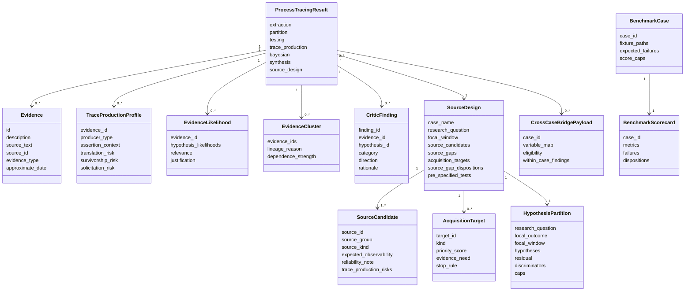
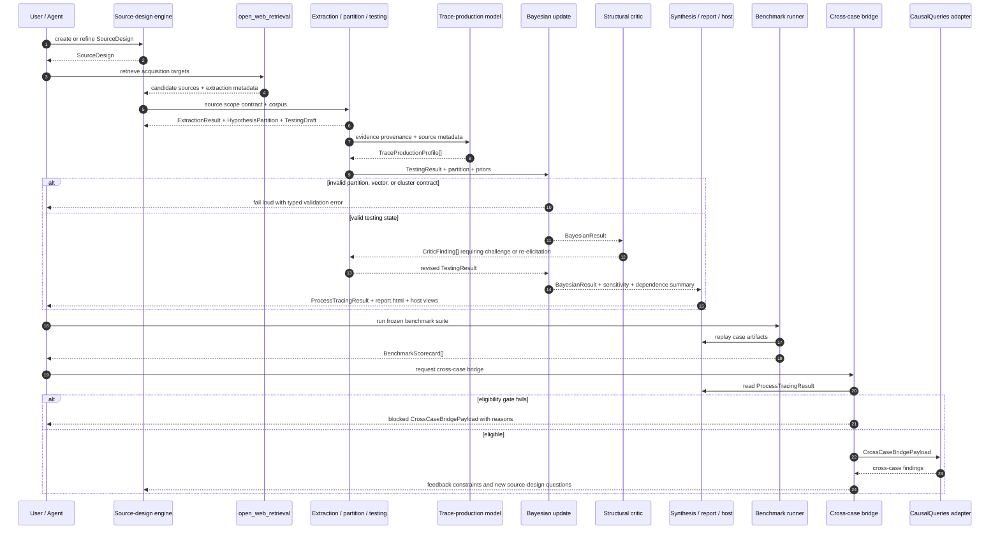

# SOTA+ Target Architecture

This document is the end-state design-plan architecture artifact for the
repository's intended SOTA+ methodology. It does not claim that every component
here is implemented. Its purpose is to make the target boundaries, contracts,
data flow, and open exploratory surfaces explicit so the slice roadmap can
converge on a known design rather than drifting by local fixes.

Use [ARCHITECTURE.md](/home/brian/projects/process_tracing/docs/ARCHITECTURE.md)
for the current implemented system. Use this document for the end-goal
architecture.

## Frame

Goal: exceed current state of the art in process tracing by combining the best
qualitative and quantitative machinery into one auditable system: active source
design, source-aware extraction, rival-hypothesis governance, coherent Bayesian
updating, explicit trace-production modeling, adversarial critique, frozen
benchmark validation, and a gated bridge to cross-case causal models.

Constraints:

- Single-case outputs remain comparative explanatory support, not identified
  effect sizes or truth probabilities.
- Every inferential transformation must remain inspectable through typed
  artifacts, report surfaces, or the interactive host.
- LLMs perform semantic labor; deterministic code owns schemas, validation,
  bookkeeping, updates, gates, and benchmark accounting.
- Missing source classes and unresolved trace-production ambiguity cap claims
  until acquired, dispositioned, or accepted as limits.
- Cross-case quantitative inference is allowed only through explicit
  eligibility gates and a separate estimand contract.

Borrow-vs-build summary:

| Capability | Decision | Rationale |
|---|---|---|
| LLM structured calls and agent harness | Borrow `llm_client` | Shared observability, typed structured output, governed workspace-agent tasks. |
| Web retrieval and extraction | Borrow `open_web_retrieval` | Search/fetch/extract failures surface through typed outputs. |
| Bayesian update and benchmark bookkeeping | Build locally | Core process-tracing and validation logic is domain-specific. |
| Cross-case causal model engine | Borrow `CausalQueries`-style tooling behind explicit adapters | The formal mixed-method bridge should reuse established causal-model software. |
| Interactive host and report surfaces | Build locally | They must expose repo-specific artifacts and methodological caveats. |

## Modality Split

| Surface | Mode | Contract |
|---|---|---|
| Source-design schema and acquisition disposition types | Deductive | Typed source-design and acquisition artifacts. |
| Partition artifact, stage schemas, benchmark scorecards | Deductive | Pydantic models and deterministic validators. |
| Bayesian update, dependence pooling, benchmark bookkeeping | Deductive | Pure Python contracts with regression tests. |
| Cross-case eligibility and bridge payload | Deductive | Typed handoff into causal-model adapters. |
| Trace-production feature set | Hybrid | Core fields are specifiable now; which features materially improve inference needs benchmark readouts. |
| Structural critic utility | Exploratory | Requires frozen-case ablations, not prompt confidence. |
| End-state benchmark thresholds | Exploratory | Must be discovered from frozen cases and hostile review. |

## Boundary Diagram

```mermaid
flowchart LR
  subgraph External["External dependencies"]
    LLM["llm_client providers"]
    Web["open_web_retrieval"]
    Agent["Codex / Claude Code via llm_client"]
    Browser["Human browser"]
    CQ["CausalQueries / QCA / statistical tooling"]
  end

  subgraph System["process_tracing SOTA+ target"]
    Corpus["Input corpus + assembled source texts"]
    Design["Source-design engine\nscope, observability, gaps, acquisition"]
    Assist["Assistant labor layer\nsource design, critique, benchmark repair"]
    Extract["Extraction + provenance\npt.pass_extract"]
    Partition["Hypothesis partition gate\nrivals, residual, discriminators"]
    Test["Diagnostic testing\nlikelihood vectors + test matrix"]
    TraceProd["Trace-production model\nsolicitation, recording, survival, translation"]
    Depend["Dependence / lineage model\ncluster + redundancy logic"]
    Update["Deterministic Bayesian update\nsupport, sensitivity, priors"]
    Critic["Structural critic\nadversarial challenge + re-elicitation"]
    Synth["Synthesis + report + host"]
    Bench["Frozen benchmark runner\nscorecards + ablations"]
    Bridge["Cross-case eligibility + bridge\nwithin-case -> causal model"]
    Artifacts["Typed artifacts\nJSON, HTML, benchmark outputs"]
  end

  Agent -->|"workspace_agent tasks"| Assist
  Assist -->|"SourceDesignDraft / CritiqueArtifact"| Design
  Corpus -->|"source text"| Extract
  Design -->|"source scope + observability contract"| Extract
  Design -->|"acquisition targets"| Web
  Web -->|"retrieved candidate sources"| Design
  Extract -->|"ExtractionResult"| Partition
  Partition -->|"HypothesisPartition"| Test
  Extract -->|"evidence + provenance"| Test
  Extract -->|"source metadata"| TraceProd
  TraceProd -->|"trace-production features"| Test
  Test -->|"TestingResult"| Depend
  Depend -->|"clustered testing inputs"| Update
  Update -->|"BayesianResult"| Critic
  Critic -->|"challenge findings"| Test
  Update -->|"comparative support"| Synth
  Design -->|"source gaps + dispositions"| Synth
  Synth -->|"report + host views"| Browser
  Synth -->|"ProcessTracingResult"| Artifacts
  Artifacts -->|"benchmark fixture inputs"| Bench
  Bench -->|"scorecards + failure localization"| Artifacts
  Artifacts -->|"eligible within-case outputs"| Bridge
  Bridge -->|"causal-model payload"| CQ
  CQ -->|"cross-case findings"| Bridge
  Bridge -->|"feedback traces + constraints"| Design
```



## Domain Model Diagram



## Data-Flow And Contract Diagram



## Typed Contracts

| Boundary | Input | Output | Failure behavior |
|---|---|---|---|
| Source-design engine | corpus metadata, prior artifacts, acquisition hits | `SourceDesign` | fail loud on unresolved path, invalid disposition, or malformed retrieval summary |
| Extraction / partition gate | source text, `SourceDesign`, theories, prior artifacts | `ExtractionResult`, `HypothesisPartition` | fail loud on malformed LLM output, overlapping partition, or missing discriminator contract |
| Trace-production model | `ExtractionResult`, `SourceDesign` | `TraceProductionProfile[]` | fail loud on unknown evidence ids or missing provenance fields |
| Testing boundary | extraction, partition, trace-production profiles | `TestingResult` | fail loud on incomplete likelihood vectors or invalid diagnostic matrix |
| Dependence pooling / update | `TestingResult`, priors | `BayesianResult` | validation rejects invalid clusters, unknown evidence, or malformed priors |
| Structural critic | `ProcessTracingResult` subset | `CriticFinding[]` | fail loud on unsupported references; any numeric change must occur through re-elicitation, not direct mutation |
| Benchmark runner | frozen case fixtures, pipeline outputs | `BenchmarkScorecard[]` | fail loud on missing fixture, missing expected failure map, or stale score schema |
| Cross-case bridge | eligible `ProcessTracingResult` set | `CrossCaseBridgePayload` | blocked when variation, measurement, or comparability gates fail |
| Interactive host | run state + typed artifacts | host JSON state + HTML views | fail loud on mixed-run artifact state or missing prerequisite stage outputs |

## Backward Runtime Pass

Final runtime payload for the end-state host and report layer:

```json
{
  "ok": true,
  "run": "Trace run state",
  "stage_artifacts": "typed artifact summaries and paths",
  "comparative_support": "BayesianResult summary",
  "source_design_status": "open gaps, dispositions, acquisition targets",
  "critic_findings": "active adversarial challenges",
  "benchmark_context": "latest relevant frozen-case score summary"
}
```

Selector and orchestrator responsibilities:

- choose which stage can run next based on artifact prerequisites;
- choose which missing source classes to pursue next based on inferential payoff;
- decide whether a case is eligible for cross-case bridge export;
- decide whether a benchmark failure points to code, prompt, source scope, or
  methodological cap.

Evidence the selector reads:

- `SourceDesign.source_gaps`
- `SourceDesign.source_gap_dispositions`
- `AcquisitionTarget.priority_score`
- `HypothesisPartition.discriminators`
- `TraceProductionProfile`
- `BayesianResult.sensitivity`
- `HypothesisPosterior.top_drivers`
- `CriticFinding`
- `BenchmarkScorecard.failures`
- `CrossCaseBridgePayload.eligibility`

Offline compiler and prior outputs:

- assembled corpus and source-design artifacts
- prior pipeline run artifacts for the case
- frozen benchmark fixtures and expected failure catalogs
- cross-case variable maps and eligibility rules
- open web retrieval cache and acquired source sidecars

Open surfaces that remain exploratory:

- which trace-production features produce stable benchmark gains;
- how strong the structural critic must be before it materially improves
  inference rather than generating noise;
- what frozen benchmark thresholds justify PhD-review-ready claims;
- how much source expansion is enough before remaining uncertainty is a limit
  rather than a defect.

## Relationship To Current Architecture

- [ARCHITECTURE.md](/home/brian/projects/process_tracing/docs/ARCHITECTURE.md)
  is the current implemented system boundary.
- This document is the target architecture the slice roadmap should converge
  toward.
- If a future slice changes the target, update this document first and then
  refresh the execution plan.
