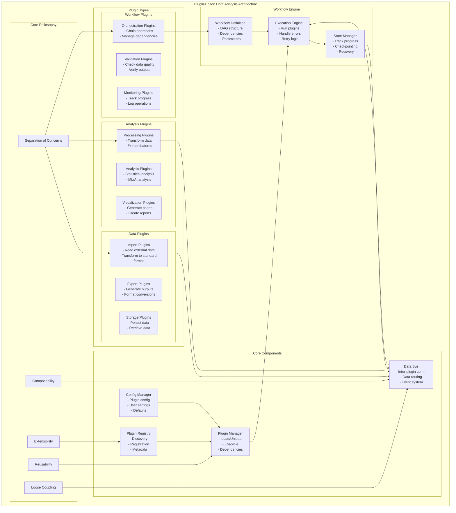

# Plugin-Based Architecture Philosophy & Concepts

## Architecture Diagram



## Key Concepts

### 1. **Plugin Architecture Philosophy**

The plugin-based architecture follows these core principles:

- **Separation of Concerns**: Each plugin has a single, well-defined responsibility
- **Composability**: Plugins can be combined in different ways to create workflows
- **Extensibility**: New functionality can be added without modifying existing code
- **Reusability**: Plugins can be used across different projects and workflows
- **Loose Coupling**: Plugins communicate through standardized interfaces

### 2. **Plugin Types**

#### **Data Plugins**
- **Purpose**: Handle data I/O operations
- **Examples**: 
  - CSV importers/exporters
  - Database connectors
  - API integrations
  - File format converters

#### **Analysis Plugins**
- **Purpose**: Process and analyze data
- **Examples**:
  - Statistical analysis
  - Machine learning models
  - Text processing
  - Pattern recognition

#### **Workflow Plugins**
- **Purpose**: Orchestrate and monitor operations
- **Examples**:
  - Pipeline orchestrators
  - Progress monitors
  - Error handlers
  - Notification systems

### 3. **Core Components**

#### **Plugin Registry**
```python
class PluginRegistry:
    """Central registry for all available plugins"""
    def register(self, plugin_class):
        """Register a new plugin"""
        
    def discover(self, path):
        """Auto-discover plugins in directory"""
        
    def get_plugin(self, plugin_id):
        """Retrieve plugin by ID"""
```

#### **Plugin Manager**
```python
class PluginManager:
    """Manages plugin lifecycle"""
    def load_plugin(self, plugin_id, config):
        """Load and initialize plugin"""
        
    def unload_plugin(self, plugin_id):
        """Cleanup and unload plugin"""
        
    def get_dependencies(self, plugin_id):
        """Get plugin dependencies"""
```

#### **Data Bus**
```python
class DataBus:
    """Inter-plugin communication system"""
    def publish(self, topic, data):
        """Publish data to topic"""
        
    def subscribe(self, topic, handler):
        """Subscribe to data topic"""
        
    def request(self, plugin_id, method, params):
        """Request data from another plugin"""
```

### 4. **Workflow Concepts**

#### **Directed Acyclic Graph (DAG)**
Workflows are represented as DAGs where:
- Nodes = Plugins
- Edges = Data flow/dependencies

```python
workflow = {
    "nodes": [
        {"id": "import", "plugin": "csv_importer"},
        {"id": "analyze", "plugin": "text_analyzer"},
        {"id": "export", "plugin": "html_generator"}
    ],
    "edges": [
        {"from": "import", "to": "analyze"},
        {"from": "analyze", "to": "export"}
    ]
}
```

#### **Execution Strategies**
- **Sequential**: Execute plugins one at a time
- **Parallel**: Execute independent plugins simultaneously
- **Streaming**: Process data in chunks as it flows through

### 5. **Advanced Concepts**

#### **Plugin Contracts**
```python
class AnalysisPlugin(ABC):
    """Base contract for analysis plugins"""
    
    @abstractmethod
    def validate_input(self, data):
        """Validate input data"""
        
    @abstractmethod
    def analyze(self, data, config):
        """Perform analysis"""
        
    @abstractmethod
    def get_output_schema(self):
        """Define output format"""
```

#### **Dependency Injection**
```python
class PluginContext:
    """Inject dependencies into plugins"""
    def __init__(self, config_manager, data_bus, logger):
        self.config = config_manager
        self.bus = data_bus
        self.logger = logger
```

#### **Event-Driven Architecture**
```python
class EventSystem:
    """Plugin event system"""
    events = [
        "plugin.loaded",
        "plugin.started", 
        "plugin.completed",
        "plugin.failed",
        "data.available",
        "workflow.completed"
    ]
```

### 6. **Benefits**

1. **Modularity**: Easy to understand, test, and maintain individual components
2. **Flexibility**: Mix and match plugins for different use cases
3. **Scalability**: Add new functionality without touching existing code
4. **Testability**: Test plugins in isolation
5. **Collaboration**: Teams can work on different plugins independently

### 7. **Common Patterns**

#### **Pipeline Pattern**
```
Input → Transform → Analyze → Output
```

#### **Fork-Join Pattern**
```
Input → Fork → [Parallel Analysis] → Join → Output
```

#### **Conditional Pattern**
```
Input → Analyze → Decision → [Branch A or B] → Output
```

### 8. **Best Practices**

1. **Standardized Interfaces**: All plugins implement common base interfaces
2. **Schema Validation**: Validate data at plugin boundaries
3. **Error Handling**: Graceful degradation and clear error messages
4. **Logging**: Comprehensive logging for debugging
5. **Configuration**: Externalize all configuration
6. **Documentation**: Clear documentation for each plugin
7. **Versioning**: Semantic versioning for plugin compatibility

### 9. **Real-World Applications**

- **Data Processing Pipelines**: ETL workflows
- **Analysis Workflows**: Multi-stage analysis with different algorithms
- **Report Generation**: Combine multiple data sources into reports
- **Quality Assurance**: Automated testing and validation workflows
- **Research Pipelines**: Reproducible research workflows

### 10. **Implementation Example**

Your qualitative coding system exemplifies this architecture:

```python
# Data Plugins
- V11ImportPlugin: Imports Phase 1 & 2 results
- CSVExportPlugin: Exports results to CSV

# Analysis Plugins  
- ContradictionAnalysisPlugin: Finds contradictions in quotes
- ThemeExtractionPlugin: Extracts themes from codes
- SpeakerAnalysisPlugin: Analyzes speaker patterns

# Workflow
workflow = [
    V11ImportPlugin(),
    ContradictionAnalysisPlugin(),
    HTMLGeneratorPlugin()
]
```

This architecture enables you to:
- Add new analysis types without modifying existing code
- Reuse plugins across different datasets
- Create custom workflows for specific research needs
- Maintain and test components independently


#Small tweaks
Concern	Lightweight addition
Observability	Auto-inject a child logger and tracing span into every plugin context.
Testing	Provide a PluginTestHarness class that spins up fake Data Bus + Config so each plugin can run isolated property tests.
Version drift	Store a compat matrix in the registry: core-API v1.4 → supports plugin v2.x … v2.3. Loader refuses mismatches.
Hot-reload in dev	Watch plugin file hashes; on change, unload → reload → re-wire DAG edges without restarting the whole app.