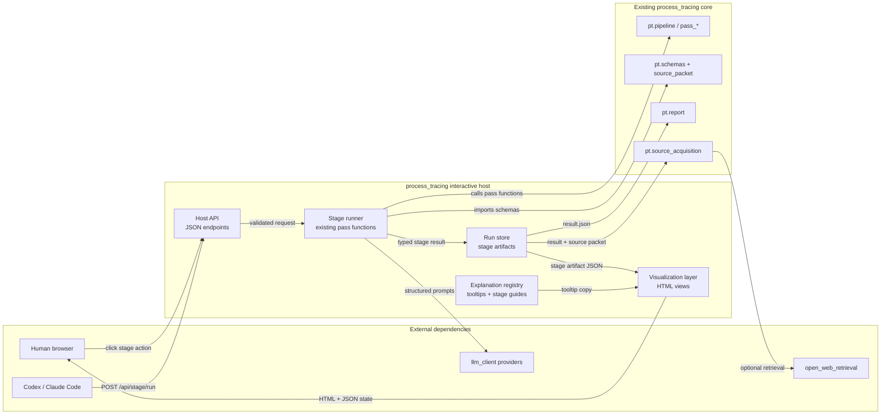
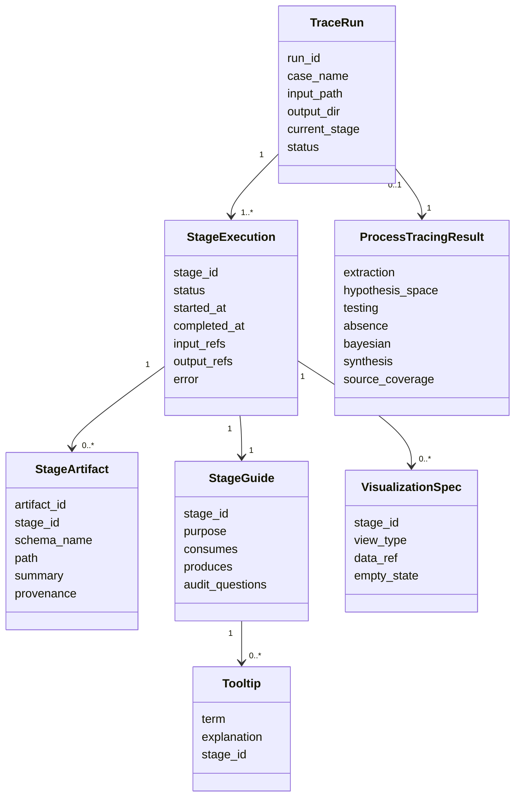
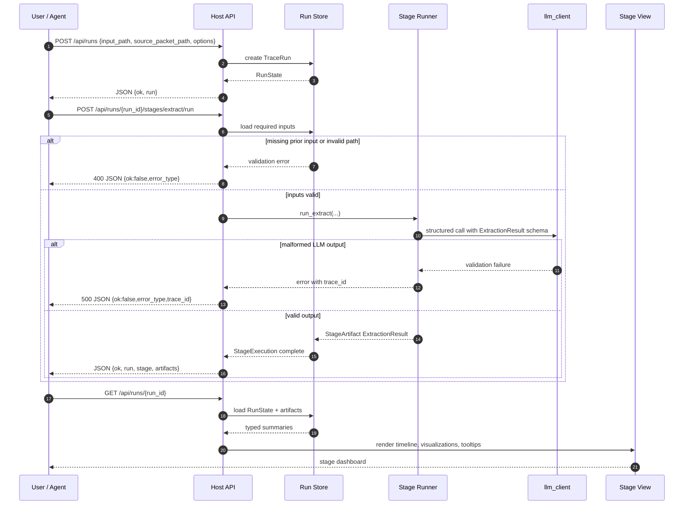

# Plan 005 - Interactive Trace Execution Host

**Status:** In progress
**Type:** implementation
**Priority:** High
**Blocked By:** None for the current host slice; later visual-audit slices remain open
**Blocks:** stage-by-stage process-tracing review, richer audit UI, source-acquisition promotion

---

## Gap

**Current:** The local workbench can load a final report and build/enrich
source-acquisition targets. It does not let a reviewer run the pipeline one
stage at a time, inspect each stage's typed output, compare intermediate
artifacts, or learn how the process-tracing method works while operating it.

**Target:** A local interactive host where a human or agent can start a real
process-tracing run, trigger each pipeline stage, inspect stage outputs with
concise explanations and tooltips, and view visual summaries wherever the data
supports them.

**Why:** The user needs to understand and audit the inferential workflow, not
only the final report. A PhD-quality process-tracing system should expose how
evidence, hypotheses, diagnostic tests, absence findings, Bayesian support, and
source gaps transform across stages.

---

## Frame

Goal: make the process-tracing pipeline inspectable as a sequence of typed,
auditable transformations without weakening the existing CLI/report path.

Constraints:

- The host must use real pipeline code and real artifacts; no mocked E2E
  success path.
- Every UI action must have a JSON API endpoint.
- Stage outputs are views over typed artifacts, not free-form UI state.
- Explanations and tooltips must be concise and interpretive, not marketing
  copy.
- Existing final-report and source-acquisition workbench capabilities must
  remain available until the new host replaces them.

Out of scope for Slice 005a:

- Multi-user auth, remote deployment, or production hosting.
- Editing and approving new source material into the corpus.
- Replacing the static report renderer.
- Solving benchmark calibration or PhD-quality grading thresholds.

Borrow-vs-build:

| Capability | Decision | Rationale |
|---|---|---|
| Local host | Build locally on current stdlib server first | The current repo already has a small agent-drivable workbench. The first slice should preserve that simplicity. |
| Stage execution | Build locally around existing pass functions | Stage boundaries are repo-specific and already typed in `pt/schemas.py`. |
| Visualizations | Build small HTML/CSS/JS views first | The first readout is whether the visual grammar helps review; avoid a frontend stack migration before the contract is proven. |
| Future richer UI | Defer Vite/React decision | If stage replay, streaming, or complex graph interaction becomes heavy, refresh this plan and choose the frontend stack explicitly. |

Clean-docs note: The current `pt.workbench` is not archived now. It remains a
tested narrow source-acquisition workbench until this host preserves or replaces
its capabilities. Archive it only after a replacement passes live E2E and an
archive rationale is written.

Implementation note: the current slice now ships `pt.trace_host` plus host API
endpoints for run creation, stage replay, and run inspection, with live non-mocked
verification recorded for run `output/workbench_runs/run_20260624_200616_d4f6`.

---

## Modality Split

| Surface | Mode | Reason |
|---|---|---|
| Stage order and typed artifacts | Deductive | Existing pipeline stages and schemas define the sequence. |
| JSON API contracts | Deductive | Request/response shapes can be specified before implementation. |
| Persistence of stage outputs | Deductive | The host can write/read a run directory with stage JSON artifacts. |
| Visual usefulness of each panel | Exploratory | We need reviewer readouts to learn which views actually improve understanding. |
| Tooltip wording and explanation density | Exploratory | Human review should tune whether text is helpful or distracting. |

Exploratory readout for Slice 005a: Brian can open the mockup/live host and
explain what each stage does, what it consumed, what it produced, and what the
main audit risk is without reading source code.

---

## Design Artifacts

Static mockup: `docs/plans/005_interactive_trace_execution_host_mockup.html`

Planning notebook / contract examples:
`docs/plans/005_interactive_trace_execution_host_contracts.ipynb`

Implementation may not start until the mockup is reviewed. If the notebook is
changed before implementation, this plan must be updated with the new contract
examples.

---

## Boundary Diagram



---

## Domain Model Diagram



---

## Data-Flow And Contract Diagram



---

## API Contract Sketch

`POST /api/runs`

```json
{
  "input_path": "input_text/source_packets/18_brumaire_source_packet.txt",
  "source_packet_path": "docs/source_packets/18_BRUMAIRE_SOURCE_PACKET.json",
  "research_question": "Why did the French Revolution culminate in Napoleon Bonaparte's 18 Brumaire coup?",
  "model": null,
  "refine": true,
  "max_budget": 1.0
}
```

returns:

```json
{
  "ok": true,
  "run": {
    "run_id": "run_20260624_001",
    "status": "ready",
    "current_stage": "extract",
    "output_dir": "output/workbench_runs/run_20260624_001"
  }
}
```

`POST /api/runs/{run_id}/stages/{stage_id}/run`

```json
{
  "force": false
}
```

returns:

```json
{
  "ok": true,
  "stage": {
    "stage_id": "extract",
    "status": "complete",
    "output_refs": ["extraction.json"]
  },
  "artifacts": [
    {
      "schema_name": "ExtractionResult",
      "path": "output/workbench_runs/run_20260624_001/extraction.json",
      "summary": "12 events, 50 evidence items, 4 mechanisms"
    }
  ]
}
```

Failure responses must use the same JSON shape across endpoints:

```json
{
  "ok": false,
  "error_type": "ValidationError",
  "error": "stage 'test' requires completed hypothesis stage",
  "trace_id": "optional llm_client trace id"
}
```

---

## Stage Views

| Stage | Consumes | Produces | Visual view | Tooltip focus |
|---|---|---|---|---|
| Setup | source text, optional packet, theories, priors | `TraceRun` | input/source packet checklist | source packet is scope control, not evidence |
| Extract | text + packet context | `ExtractionResult` | temporal event lane, evidence/source table, causal edge list | evidence vs event vs mechanism |
| Hypothesize | extraction + theories | `HypothesisSpace` | hypothesis cards with mechanism chains and predictions | rival hypotheses and distinguishability |
| Test | extraction + hypotheses | `TestingResult` | evidence-by-hypothesis diagnostic matrix | likelihood vector, hoop/smoking gun labels |
| Absence | extraction + hypotheses + testing | `AbsenceResult` | missing-evidence warnings by hypothesis | when absence is informative |
| Update | testing + priors | `BayesianResult` | support bars, top-driver deltas, sensitivity band | support is comparative, not truth probability |
| Synthesize | all prior artifacts | `SynthesisResult` | claim/caveat split and source-scope caps | what can and cannot be concluded |
| Refine | full first pass | `RefinementResult` | before/after delta board | second reading changes inference only if rerun |
| Acquisition | result + source packet | `AcquisitionPlan` | ranked evidence needs and web-query agenda | retrieved hit is not evidence yet |

---

## Acceptance Criteria

- Static mockup is reviewed before implementation.
- Host exposes JSON endpoints for run creation, stage execution, run state,
  artifact reads, and report/source-acquisition views.
- Deterministic tests cover stage-order validation, error JSON, artifact
  persistence, and one stage visualization payload.
- Live non-mocked E2E runs Brumaire through at least setup, extract,
  hypothesize, test, update, synthesize, and report generation through the host.
- The UI shows concise explanations and tooltips for stage purpose, consumed
  inputs, produced outputs, and main audit risk.
- Existing source-acquisition workbench behavior remains available or is
  explicitly replaced by equivalent host functionality.
- Adversarial review checks whether the host clarifies method rather than
  merely adding a nicer dashboard.
- Cleanup updates `docs/ARCHITECTURE.md`, Plan 003 progress, wiki, and archive
  rationale if any old surface is retired.

---

## Failure Modes

| Failure | Diagnostic | Response |
|---|---|---|
| UI looks complete but uses stale artifacts | Compare stage timestamps and run ids | Show artifact provenance in every stage panel and reject mixed-run state unless explicitly loaded as comparison |
| User treats retrieved web hit as evidence | Check acquisition panel labels | Label hits as candidates only; require promotion/rerun in a later slice |
| Stage can run out of order | Stage-order test fails | Block with 400 JSON and explain missing prerequisites |
| Visualizations hide uncertainty | Audit reads only charts, not caveats | Pair every chart with source/gap/sensitivity caveat chips |
| Host duplicates pipeline logic | Diff shows reimplemented pass behavior | Host runner must call existing pass functions or `run_pipeline` helpers |
| Current workbench becomes confusing legacy | Both hosts offer overlapping buttons | Mark old route as narrow source-acquisition surface; archive after replacement passes live E2E |

---

## Slice Roadmap

### Slice 005a - Mockup And Contract Approval

**Goal:** approve the interaction model and contracts before implementation.

**Done when:** Brian reviews the mockup, requested changes are dispositioned,
contract notebook examples are current, and this plan is updated.

### Slice 005b - Stage Host Walking Skeleton

**Goal:** create a local host that can create a run, execute setup/extract, and
show typed extraction artifacts with explanations.

**Done when:** deterministic tests pass, one live non-mocked extract stage runs
through the host, and review confirms artifact provenance is visible.

### Slice 005c - Full Stage Execution

**Goal:** run extract through synthesize stage-by-stage and persist every stage
artifact.

**Done when:** live Brumaire host E2E completes through report generation and
`make check` passes.

### Slice 005d - Visual Audit Panels

**Goal:** add matrix, support, sensitivity, source-coverage, and acquisition
views driven from stage artifacts.

**Done when:** adversarial review finds the views improve method
interpretability without creating unsupported causal claims.

### Slice 005e - Retire Or Fold Old Workbench

**Goal:** decide whether `pt.workbench` remains as a source-acquisition alias or
is archived/superseded.

**Done when:** equivalent acquisition behavior exists in the new host, archive
rationale is written if code/docs move, and old search surfaces no longer
compete with active docs.
