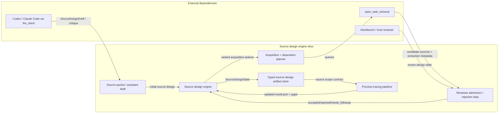
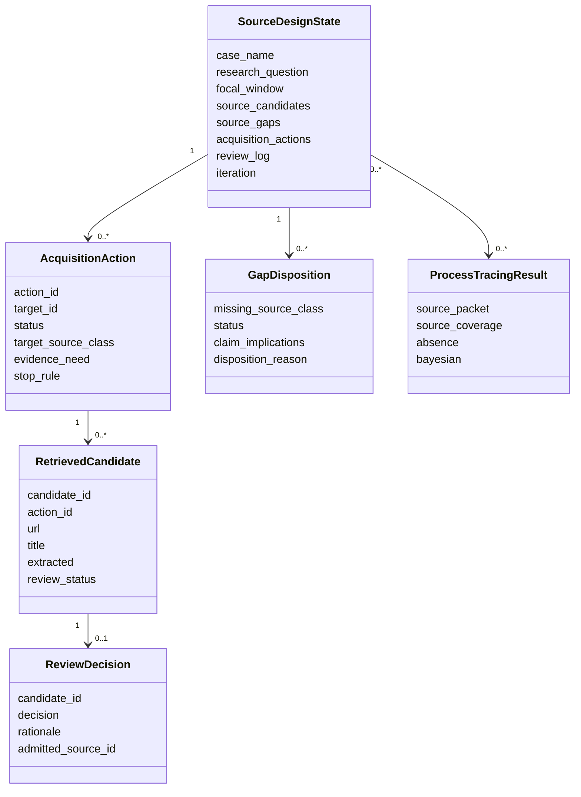
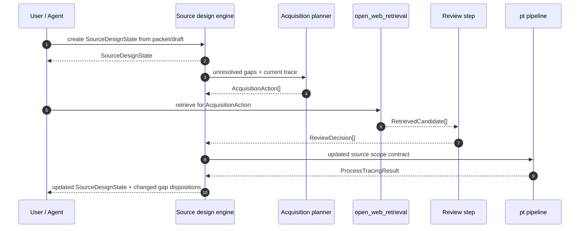

# Plan 006 - Source Design Engine

**Status:** Complete
**Type:** implementation
**Priority:** Critical
**Blocked By:** None
**Blocks:** trace-production modeling, benchmarked source-adequacy gates, stronger cross-case bridge inputs

---

## Gap

**Current:** The repo has a typed `SourcePacket` contract, deterministic
source-coverage checks, and a source-acquisition planner that ranks missing
evidence from an existing trace. Those pieces are adjacent, but they are not
yet a closed-loop source-design engine. Retrieval outputs remain sidecars, gap
dispositions are mostly hand-authored, and the repo does not yet persist an
iterable "design state" that can propose, critique, acquire, and disposition
source classes across repeated runs.

**Target:** A typed source-design engine that starts from a source packet or
assistant draft, derives acquisition/disposition actions, records search and
review outcomes, and emits an updated source-design artifact that governs the
next trace iteration.

**Why:** SOTA+ depends on treating source design as an active methodological
engine rather than a static preface. Without this, source packets look more
complete than they are, retrieval remains advisory rather than inferentially
integrated, and unresolved source gaps are too easy to leave ambient.

---

## References Reviewed

- [pt/source_packet.py](/home/brian/projects/process_tracing/pt/source_packet.py) - current source-packet contract and summary surfaces.
- [pt/source_acquisition.py](/home/brian/projects/process_tracing/pt/source_acquisition.py) - current acquisition-target planner and live retrieval integration.
- [tests/test_source_acquisition.py](/home/brian/projects/process_tracing/tests/test_source_acquisition.py) - current deterministic gates for source-acquisition planning.
- [docs/plans/002_sota_plus_recovery_plan.md](/home/brian/projects/process_tracing/docs/plans/002_sota_plus_recovery_plan.md) - capability ladder and source-design target.
- [docs/plans/003_sota_plus_execution_master_plan.md](/home/brian/projects/process_tracing/docs/plans/003_sota_plus_execution_master_plan.md) - slice roadmap and universal slice contract.
- [docs/SOTA_PLUS_TARGET_ARCHITECTURE.md](/home/brian/projects/process_tracing/docs/SOTA_PLUS_TARGET_ARCHITECTURE.md) - end-goal boundary/domain/data-flow package.
- [docs/source_packets/18_BRUMAIRE_SOURCE_PACKET.json](/home/brian/projects/process_tracing/docs/source_packets/18_BRUMAIRE_SOURCE_PACKET.json) - active benchmark packet shape and current limitations.
- [CLAUDE.md](/home/brian/projects/process_tracing/CLAUDE.md) - repo workflow rules and live E2E expectations.

---

## Files Affected

- `pt/source_packet.py` (extend)
- `pt/source_acquisition.py` (extend/refactor)
- `pt/source_design.py` (new typed source-design state layer)
- `scripts/source_acquisition_plan.py` (emit source-design state sidecar)
- `pt/workbench.py` or successor host route (modify later slice if needed)
- `tests/test_source_packet.py` (extend)
- `tests/test_source_acquisition.py` (extend)
- `tests/test_pipeline_integration.py` (extend)
- `docs/source_packets/*` (update benchmark artifacts)
- `docs/ARCHITECTURE.md` (update if contracts/boundaries change during implementation)

---

## Frame

Goal: make source design a first-class iterative engine that drives what the
next process-tracing run should read, what remaining gaps still cap the claim,
and what acquisition/disposition actions remain open.

Constraints:

- Source-design metadata is not likelihood evidence by itself.
- Live non-mocked E2E remains mandatory for implementation completion.
- A retrieved source stays a candidate until it is reviewed, admitted into the
  source design, and rerun through the pipeline.
- Search and disposition history must be durable and typed, not hidden in chat
  or screenshots.

Out of scope for the first implementation slice:

- Fully automated admission of retrieved sources into the corpus.
- Provider-specific retrieval ranking research.
- Trace-production weighting inside the Bayesian update.

Borrow-vs-build:

| Capability | Decision | Rationale |
|---|---|---|
| Retrieval/search | Borrow `open_web_retrieval` | Existing typed search/fetch/extract layer is already in use. |
| Source-design state machine | Build locally | The contract is specific to process-tracing methodology and claim-scope governance. |
| Assistant drafting/critique | Borrow `llm_client` workspace-agent | Source-design labor should use the governed assistant path. |

Clean-docs note: this plan upgrades the active "source packet" concept toward
"source design" without invalidating current packet artifacts. Existing packet
docs remain active, but future slices should prefer the term "source design"
when referring to the iterative end-state.

---

## Modality Split

| Surface | Mode | Reason |
|---|---|---|
| Source-design state schema | Deductive | Artifact shape and transitions can be specified up front. |
| Acquisition/disposition action types | Deductive | We can define the allowed statuses, evidence, and failure semantics now. |
| Ranking logic for unresolved targets | Hybrid | Basic ordering rules are specifiable; exact weighting still needs case readouts. |
| Retrieval usefulness per source class | Exploratory | Needs benchmark cases and hostile review, not guessed thresholds. |

Exploratory readout for this slice: after a live Brumaire run and one source
design iteration, the repo should be able to show which acquisition actions
were proposed, which were attempted, which were admitted or rejected, and how
the remaining gaps changed.

---

## Design Artifacts

Static seam mockup:
[006_source_design_engine_mockup.md](/home/brian/projects/process_tracing/docs/plans/006_source_design_engine_mockup.md)

Planning notebook / contract examples:
[006_source_design_engine_contracts.ipynb](/home/brian/projects/process_tracing/docs/plans/006_source_design_engine_contracts.ipynb)

Implementation should not start until the mockup and notebook are reviewed.

---

## Boundary Diagram



---

## Domain Model Diagram



---

## Data-Flow And Contract Diagram



---

## Contract Sketch

Initial design-state artifact:

```json
{
  "case_name": "18 Brumaire",
  "research_question": "Why did the French Revolution culminate in Napoleon Bonaparte's 18 Brumaire coup?",
  "iteration": 1,
  "source_candidates": ["...existing packet sources..."],
  "source_gaps": ["...known gaps..."],
  "acquisition_actions": [],
  "review_log": []
}
```

Acquisition action example:

```json
{
  "action_id": "acq_gap_1",
  "target_id": "acq_gap_1",
  "status": "proposed",
  "target_source_class": "Private correspondence among conspirators",
  "evidence_need": "Private planning sequence and coalition bargaining",
  "stop_rule": "Stop when direct sources are acquired or three independent searches only yield substitutes."
}
```

Review decision example:

```json
{
  "candidate_id": "cand_001",
  "decision": "reject_as_adjacent",
  "rationale": "Retrospective memoir repeats already-admitted lineage and does not resolve the direct correspondence gap.",
  "admitted_source_id": null
}
```

Failure shape:

```json
{
  "ok": false,
  "error_type": "SourceDesignValidationError",
  "error": "candidate review decision references unknown acquisition action"
}
```

---

## Plan

### Steps

1. Define a typed `SourceDesignState` contract that extends the current packet
   concept with acquisition actions and review history.
2. Extend acquisition planning so it can write machine-readable `AcquisitionAction`
   records rather than only a ranked agenda.
3. Add a review/admission contract for retrieved candidates and gap
   disposition updates.
4. Thread the updated source-design state through one live Brumaire iteration.
5. Update docs, host surfaces, and tests so the iterative loop is inspectable.

---

## Required Tests

### New Tests (TDD)

| Test File | Test Function | What It Verifies |
|-----------|---------------|------------------|
| `tests/test_source_packet.py` | `test_source_design_state_round_trips_with_actions_and_review_log` | Extended source-design artifact validates and persists acquisition/review state. |
| `tests/test_source_acquisition.py` | `test_acquisition_plan_emits_action_records_with_status` | Planner writes typed acquisition actions, not only freeform agenda text. |
| `tests/test_source_acquisition.py` | `test_review_decision_updates_gap_disposition_without_admitting_evidence` | Review/disposition updates claim-scope state without pretending candidate retrieval is already evidence. |
| `tests/test_pipeline_integration.py` | `test_pipeline_result_can_refresh_source_design_state` | A real `ProcessTracingResult` can update the source-design state for the next iteration. |

### Existing Tests (Must Pass)

| Test Pattern | Why |
|--------------|-----|
| `tests/test_source_acquisition.py` | Existing acquisition ranking behavior must stay valid while contracts expand. |
| `tests/test_workbench.py` | Current acquisition UI/API must keep working until the new host replaces it. |
| `tests/test_architecture_docs.py` | Architecture docs must remain aligned as contracts change. |
| `make check` | Full repo regression gate. |

---

## Acceptance Criteria

- [x] `SourceDesignState` exists as a typed artifact distinct from, but compatible with, the current source packet.
- [x] Acquisition planning emits typed action records with explicit status and stop rules.
- [x] Review/disposition state is durable and does not confuse candidate retrieval with admitted evidence.
- [x] One live non-mocked Brumaire iteration updates source-design state after retrieval/review and rerun.
- [x] The report or host can show current gap status, acquisition actions, and review outcomes.
- [x] `make check` passes.
- [x] Architecture and methodology docs are updated if implementation changes the boundary or data flow.

---

## Notes

- This plan intentionally does not collapse source design into the interactive
  host. The host is a view and control surface; the source-design state is the
  durable artifact.
- The first implementation can stay conservative about admission. Manual review
  of retrieved candidates is acceptable; silent auto-admission is not.
- Trace-production weighting belongs to a later slice, but this slice should
  leave enough provenance structure that later weighting does not require
  redesigning the artifact family.
